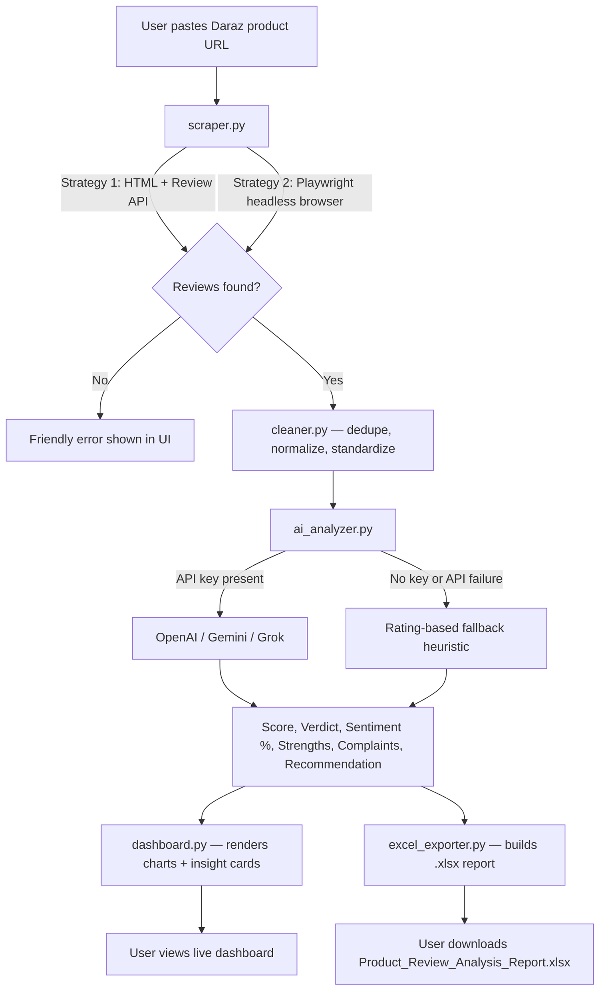

<div align="center">

# 🛍️ AI Product Review Intelligence Dashboard

### Turn any Daraz product link into a data-backed buy/no-buy verdict in seconds.

A full-stack **AI + Data Engineering SaaS** that scrapes customer reviews from Daraz,
cleans and structures the data, runs multi-provider AI sentiment analysis, and ships
an interactive analytics dashboard with a one-click Excel intelligence report.

[](https://www.python.org/)
[](https://streamlit.io/)
[](#)
[](https://pandas.pydata.org/)
[](#)

</div>

---

## 📌 Overview

E-commerce buyers in Pakistan scroll through hundreds of reviews before trusting a
product. This tool removes that friction: paste a Daraz product URL, and within
seconds get a **scraped, cleaned, AI-analyzed verdict** — overall score out of 10,
sentiment breakdown, what customers love, what they complain about, and a clear
recommendation — plus a downloadable Excel report formatted for business use.

It's built the way a real internal analytics tool at an e-commerce company would be:
modular, fault-tolerant, multi-provider, and designed to **never crash on bad input**.

---

## ✨ Key Features

| Feature | Detail |
|---|---|
| 🌐 **Smart Scraper** | Validates the URL, extracts product + review data, paginates automatically, falls back to a headless browser if the page is JS-rendered |
| 🧹 **Data Cleaning Pipeline** | De-duplicates, removes empty reviews, normalizes whitespace, standardizes dates and ratings — without ever cutting or summarizing review text |
| 🤖 **Multi-Provider AI Engine** | One config switch between **OpenAI**, **Google Gemini**, or **xAI Grok** — no code changes needed |
| 🧠 **AI Verdict Generation** | Overall score /10, classification (Winning / Good / Average / Not Recommended), strengths, complaints, and a written buy recommendation grounded in real review text |
| 📊 **Live Analytics Dashboard** | Sentiment donut chart, rating distribution, metric tiles — built with Plotly |
| 📥 **One-Click Excel Export** | Professionally formatted `.xlsx` with a Summary sheet and a full sentiment-labeled Reviews sheet |
| 🛟 **Production-Grade Error Handling** | Invalid links, zero reviews, network failures, and AI outages all degrade gracefully to a friendly message — never a crash |
| 🎨 **Custom SaaS UI** | Glassmorphism dashboard with a gradient "intelligence console" theme, built entirely in Streamlit with custom CSS |

---

## 🏗️ How It Works — System Architecture



**The pipeline in plain terms:**

1. **Scrape** — `scraper.py` tries to pull reviews directly through Daraz's review API
   (fast, lightweight). If that fails — JS-only rendering, bot wall, markup change —
   it automatically falls back to a headless Playwright browser that clicks through
   the actual review tabs and pages like a real user would.
2. **Clean** — `cleaner.py` takes the raw scrape and produces a clean, analysis-ready
   dataset: duplicates removed, empty reviews dropped, dates standardized to
   `YYYY-MM-DD`, ratings normalized to a 0–5 scale.
3. **Analyze** — `ai_analyzer.py` sends a representative sample of the cleaned reviews
   to whichever AI provider is configured. The model returns a strict JSON verdict:
   score, classification label, sentiment split, strengths, complaints, and a written
   recommendation. If no key is set or the API call fails for any reason, the system
   transparently falls back to a rating/keyword-based heuristic — the dashboard always
   produces an answer.
4. **Visualize** — `dashboard.py` renders everything as metric tiles, a sentiment
   donut, a rating-distribution bar chart, and insight cards.
5. **Export** — `excel_exporter.py` builds a polished, two-sheet Excel workbook
   (Summary + full Reviews list with per-review sentiment labels) available as a
   one-click download.

---

## 🧱 Tech Stack

| Layer | Technology |
|---|---|
| **Frontend / UI** | Streamlit, custom CSS (glassmorphism + gradient theme), Plotly |
| **Web Scraping** | Requests, BeautifulSoup, Playwright (headless Chromium fallback) |
| **Data Processing** | Pandas |
| **AI / NLP** | OpenAI API, Google Gemini API, xAI Grok API (pluggable) |
| **Reporting** | OpenPyXL (formatted Excel generation) |
| **Configuration** | python-dotenv |
| **Language** | Python 3.11 |

---

## 📂 Project Structure

```
daraz-review-intelligence/
├── app.py              # Streamlit entry point — orchestrates the full pipeline
├── scraper.py            # Daraz scraping engine (review API + Playwright fallback)
├── cleaner.py              # Data cleaning & normalization pipeline
├── ai_analyzer.py            # Multi-provider AI analysis engine + safe fallback
├── dashboard.py                # UI components — CSS theme, cards, charts
├── excel_exporter.py             # Builds the downloadable .xlsx report
├── config.py                       # Central settings, loaded from .env
├── utils.py                         # Shared helpers (validation, text cleanup, sentiment fallback)
├── requirements.txt
├── .env.example
└── .streamlit/config.toml             # Dark theme configuration
```

---

## 🚀 Getting Started

```bash
# 1. Clone / extract the project
git clone https://github.com/AbdulRehmanRaza03/daraz-review-intelligence.git
cd daraz-review-intelligence

# 2. Create a virtual environment
python -m venv venv
venv\Scripts\activate        # Windows
source venv/bin/activate     # macOS / Linux

# 3. Install dependencies
pip install -r requirements.txt
playwright install chromium

# 4. Configure your AI provider
cp .env.example .env
# open .env and set AI_PROVIDER + the matching API key

# 5. Run
streamlit run app.py
```

> No AI key? The app still runs fully on a transparent rating-based fallback — perfect
> for demoing the UI/UX before wiring up a paid API key.

**Deploying:** push to GitHub → [share.streamlit.io](https://share.streamlit.io) →
point to `app.py` → add your API key under **Secrets**. Done.

---

## 🛟 Reliability by Design

| Failure scenario | What happens |
|---|---|
| Invalid / non-Daraz URL | Clear inline error, no crash |
| Zero reviews on product | Friendly explanation shown |
| Network timeout / bot block | Automatic fallback strategy, then graceful error |
| AI API key missing or request fails | Silent fallback to heuristic scoring, UI banner explains it |

---

## 🔭 Roadmap

- [ ] Multi-marketplace support (AliExpress, Amazon.sa)
- [ ] Historical price + review-trend tracking per product
- [ ] PDF export alongside Excel
- [ ] Bulk URL batch analysis mode

---

## 👨‍💻 About the Developer

**Abdul Rehman Raza**
BS Data Science Student | Aspiring AI/ML & Data Engineer | Full-Stack Builder

📞 +92 318 1678758
📧 abdulrehmanraza60@gmail.com
💻 GitHub — https://github.com/AbdulRehmanRaza03
🔗 LinkedIn — https://www.linkedin.com/in/abdul-rehman-raza-7a125b332
🌐 Portfolio — https://abdulrehmanraza03.github.io/My-Portfolio/

---

## 🗂️ More of My Work

| Project | Type | Live Link |
|---|---|---|
| ABD Wears — E-commerce Storefront | Full-Stack Web | https://abdulrehmanraza03.github.io/ABD-Wears-Weabsite/#/ |
| FFC Pizza Restaurant Website | Frontend Web | https://abdulrehmanraza03.github.io/FFC_Pizza_Restaurent/ |
| Service/Booking Tool | Web App | https://replit-tool--theabdulservice.replit.app/#collections |
| AI Screen Recorder Web App | Streamlit / Python | https://abd-screen-recorder-web-app.streamlit.app/ |
| Customer Churn Prediction Analytics | Data Science / ML | https://customer-churn-prediction-analytics-5syak8uuar5rp4f8ihphvs.streamlit.app/ |

---

## 📜 License

Built as a professional portfolio project. Free to explore and adapt — please respect
Daraz's Terms of Service for any scraping usage.

<div align="center">

**If this project helped you or impressed you, consider connecting on LinkedIn 🤝**

</div>
